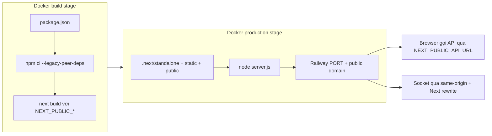

# Hướng dẫn deploy FindU Frontend lên Railway

Tài liệu mô tả các bước deploy thực tế đã thực hiện cho project **Next.js 15** này, kèm giải thích từng file cấu hình và cách xử lý lỗi thường gặp.

---

## Mục lục

1. [Tổng quan kiến trúc](#1-tổng-quan-kiến-trúc)
2. [Điều kiện cần có](#2-điều-kiện-cần-có)
3. [Cấu hình trong repository](#3-cấu-hình-trong-repository)
4. [Chạy local trước khi deploy](#4-chạy-local-trước-khi-deploy)
5. [Deploy lên Railway (CLI)](#5-deploy-lên-railway-cli)
6. [Biến môi trường](#6-biến-môi-trường)
7. [Sau khi deploy](#7-sau-khi-deploy)
8. [Deploy lại (redeploy)](#8-deploy-lại-redeploy)
9. [Lỗi đã gặp khi deploy và cách xử lý](#9-lỗi-đã-gặp-khi-deploy-và-cách-xử-lý)
10. [Kiểm tra project Railway đang link](#10-kiểm-tra-project-railway-đang-link)
11. [Tách project riêng (tùy chọn)](#11-tách-project-riêng-tùy-chọn)

---

## 1. Tổng quan kiến trúc

### URL production (hiện tại)

| Thành phần | URL |
|------------|-----|
| Frontend | https://findu-frontend-production.up.railway.app |
| Backend API | https://findu-api-production.up.railway.app |

### Cách tổ chức trên Railway

Frontend **không** nằm trong project Railway tên `findu-frontend` riêng. Thay vào đó:

- **Project Railway:** `findu-backend`
- **Service frontend:** `findu-frontend`
- **Service API (đã có sẵn):** `findu-api`
- **Database:** MongoDB, Redis (cùng project)

Đây là mô hình **một project – nhiều service**: toàn bộ stack FindU (API, FE, DB) quản lý chung trên một dashboard. Frontend vẫn có domain và deploy độc lập với API.

### Luồng build & chạy



- Build dùng **Dockerfile** (không dùng Nixpacks mặc định).
- `next.config.ts` bật `output: 'standalone'` → image production chạy `node server.js`.
- Biến `NEXT_PUBLIC_*` phải có **lúc build** (Next.js nhúng vào bundle client).

---

## 2. Điều kiện cần có

| Yêu cầu | Ghi chú |
|---------|---------|
| Node.js 20+ | Khớp image Docker `node:20-alpine` |
| Railway CLI | `brew install railway` hoặc https://docs.railway.com/guides/cli |
| Đăng nhập Railway | `railway login` |
| Backend đã chạy | API production sẵn sàng, CORS/OAuth cấu hình đúng |
| File `.env.local` (local) | Không commit; dùng khi `npm run dev` |

---

## 3. Cấu hình trong repository

Các file sau phục vụ deploy (đã thêm/cập nhật khi deploy lần đầu).

### 3.1. `Dockerfile`

**Mục đích:** Build image production hai giai đoạn (builder + runtime).

| Phần | Việc làm |
|------|----------|
| **Builder** | `npm ci --legacy-peer-deps` → `npm run build` |
| **ARG/ENV `NEXT_PUBLIC_*`** | Truyền URL backend vào lúc build (bắt buộc với Next.js) |
| **Production** | Copy `.next/standalone`, `.next/static`, `public` |
| **`HOSTNAME=0.0.0.0`** | Container lắng nghe mọi interface (Railway cần) |
| **`CMD ["node", "server.js"]`** | Chạy server standalone của Next.js |

`--legacy-peer-deps`: project dùng React 19 trong khi một số package (ví dụ `lucide-react`) chưa khai báo peer dependency cho React 19 → `npm ci` thường fail nếu không có flag này.

Railway tự gán biến `PORT` khi chạy container; Next.js standalone đọc `PORT` (không cố định 3001 trên production).

### 3.2. `railway.toml`

**Mục đích:** Báo Railway dùng Dockerfile và cấu hình healthcheck.

```toml
[build]
builder = "DOCKERFILE"
dockerfilePath = "Dockerfile"

[deploy]
healthcheckPath = "/"
healthcheckTimeout = 300
restartPolicyType = "ON_FAILURE"
```

- **healthcheckPath `/`:** Railway gọi trang chủ để biết deploy healthy.
- **restartPolicyType:** Tự restart khi process crash.

### 3.3. `.dockerignore`

Loại trừ `node_modules`, `.next`, `.git`, `.env*`, v.v. khỏi context upload → build nhanh hơn, tránh lộ secret.

### 3.4. `next.config.ts`

- `output: 'standalone'`: bắt buộc cho Dockerfile hiện tại.
- `rewrites`: proxy `/socket.io` về backend (browser dùng same-origin, tránh CORS).
- `images.remotePatterns`: thêm hostname `findu-api-production.up.railway.app` cho ảnh upload từ API.

### 3.5. `public/.gitkeep`

Dockerfile copy thư mục `public/`. Thư mục rỗng vẫn cần tồn tại trong Git để bước `COPY` không lỗi.

### 3.6. `.env.local` (chỉ local)

```env
NEXT_PUBLIC_API_URL=https://findu-api-production.up.railway.app/api
NEXT_PUBLIC_SOCKET_URL=https://findu-api-production.up.railway.app/
NEXT_PUBLIC_BACKEND_URL=https://findu-api-production.up.railway.app/
```

File này nằm trong `.gitignore`. Trên Railway, cùng bộ biến được set trên **service** `findu-frontend`.

### 3.7. Sửa code để build production pass

| File | Vấn đề | Cách xử lý |
|------|--------|------------|
| `package.json` | Next `15.0.0` bị Railway chặn (CVE) | Nâng `next` và `eslint-config-next` lên `15.0.7` |
| `src/lib/api.ts` | ESLint `@typescript-eslint/no-non-null-asserted-optional-chain` | Kiểm tra `res.data?.data` thay vì `!` |
| `src/app/auth/callback/page.tsx` | `useSearchParams()` cần Suspense | Tách `AuthCallbackContent` + bọc `<Suspense>` |

---

## 4. Chạy local trước khi deploy

### 4.1. Cài dependency

```bash
cd /path/to/findu-frontend
npm install --legacy-peer-deps
```

### 4.2. Tạo `.env.local`

Copy nội dung mục [3.6](#36-envlocal-chỉ-local) hoặc trỏ về backend local nếu dev full-stack local.

### 4.3. Chạy dev server

```bash
npm run dev
```

Mở http://localhost:3001 (port cố định trong `package.json`).

### 4.4. Kiểm tra build production (khuyến nghị)

```bash
npm run build
```

Nếu bước này fail trên máy bạn, deploy Railway cũng sẽ fail tương tự (lint, type, prerender).

---

## 5. Deploy lên Railway (CLI)

### Bước 1: Đăng nhập

```bash
railway login
railway whoami
```

### Bước 2: Link project và environment

Trong thư mục repo frontend:

```bash
cd /path/to/findu-frontend
railway link -p findu-backend -e production
```

- `-p findu-backend`: project đã chứa service `findu-api` (backend production).
- `-e production`: environment deploy thật.

Nếu có nhiều service, CLI có thể báo chưa chọn service — bước 3–4 xử lý tiếp.

### Bước 3: Tạo service frontend (lần đầu)

Chỉ cần chạy **một lần** khi chưa có service `findu-frontend`:

```bash
railway add --service findu-frontend \
  --variables "NEXT_PUBLIC_API_URL=https://findu-api-production.up.railway.app/api" \
  --variables "NEXT_PUBLIC_SOCKET_URL=https://findu-api-production.up.railway.app/" \
  --variables "NEXT_PUBLIC_BACKEND_URL=https://findu-api-production.up.railway.app/"
```

**Giải thích:**

- Tạo service trống trong project `findu-backend`.
- Gán luôn 3 biến `NEXT_PUBLIC_*` (Railway đưa vào build Docker và runtime).

### Bước 4: Link service đang deploy

```bash
railway service link findu-frontend
```

Mọi lệnh `railway up`, `railway variable`, `railway logs` sau đó áp dụng cho service này.

### Bước 5: Upload và deploy

```bash
railway up --detach -m "Deploy Next.js frontend"
```

- Upload source (theo `.dockerignore`).
- Railway build image từ `Dockerfile`, deploy lên region (ví dụ `sfo`).
- `--detach`: không treo terminal chờ log; xem log trên dashboard hoặc `railway logs`.

Theo dõi deployment:

```bash
railway deployment list --json
railway logs --build --latest -n 100
```

### Bước 6: Tạo domain public (lần đầu)

```bash
railway domain
```

Kết quả deploy thực tế:

```
https://findu-frontend-production.up.railway.app
```

Mỗi service Railway thường có **tối đa một** domain `*.up.railway.app` miễn phí (có thể thêm custom domain sau).

---

## 6. Biến môi trường

| Biến | Ví dụ production | Vai trò |
|------|------------------|---------|
| `NEXT_PUBLIC_API_URL` | `https://findu-api-production.up.railway.app/api` | Axios/fetch gọi REST API |
| `NEXT_PUBLIC_SOCKET_URL` | `https://findu-api-production.up.railway.app/` | Fallback URL socket (SSR) |
| `NEXT_PUBLIC_BACKEND_URL` | `https://findu-api-production.up.railway.app/` | Rewrite `/socket.io` trong `next.config.ts`; upload avatar |

**Lưu ý quan trọng:**

- Tiền tố `NEXT_PUBLIC_` → giá trị **nhúng vào bundle client** lúc `next build`.
- Đổi biến trên Railway dashboard **không** đủ nếu không **build lại** (deploy mới).
- Không đặt secret vào `NEXT_PUBLIC_*` (client đọc được).

### Xem / sửa biến bằng CLI

```bash
railway variable list --service findu-frontend

railway variable set NEXT_PUBLIC_API_URL=https://findu-api-production.up.railway.app/api \
  --service findu-frontend
```

Sau khi đổi biến `NEXT_PUBLIC_*`, chạy lại `railway up` để rebuild.

---

## 7. Sau khi deploy

### 7.1. Kiểm tra nhanh

```bash
curl -I https://findu-frontend-production.up.railway.app/
```

Kỳ vọng: `HTTP/2 200`, header `x-powered-by: Next.js`.

### 7.2. Cấu hình backend (bắt buộc cho OAuth)

Trên backend (`findu-api`), thêm redirect URL OAuth:

```
https://findu-frontend-production.up.railway.app/auth/callback
```

Và đảm bảo CORS cho phép origin frontend (nếu có gọi cross-origin trực tiếp).

### 7.3. Dashboard Railway

- Project: **findu-backend**
- Service: **findu-frontend** → tab Deployments, Variables, Metrics, Logs

---

## 8. Deploy lại (redeploy)

Sau khi sửa code và đã link đúng service:

```bash
cd /path/to/findu-frontend
railway status          # xác nhận project + service
railway up --detach -m "Mô tả thay đổi ngắn"
```

Hoặc redeploy bản build hiện tại (không upload code mới):

```bash
railway service redeploy
```

---

## 9. Lỗi đã gặp khi deploy và cách xử lý

### 9.1. Railway chặn Next.js 15.0.0 (bảo mật)

**Triệu chứng:** Deploy fail ngay, log báo vulnerability, yêu cầu `next@^15.0.7`.

**Xử lý:** Nâng `next` và `eslint-config-next` trong `package.json`, chạy `npm install --legacy-peer-deps`, commit `package-lock.json`, deploy lại.

### 9.2. ESLint fail khi build

**Triệu chứng:** `Failed to compile` — rule `@typescript-eslint/no-non-null-asserted-optional-chain` tại `src/lib/api.ts`.

**Xử lý:** Không dùng `res.data?.data!`; kiểm tra null rồi `throw`.

### 9.3. `useSearchParams()` thiếu Suspense

**Triệu chứng:** Prerender error tại `/auth/callback`.

**Xử lý:** Tách component dùng `useSearchParams` và bọc bằng `<Suspense fallback={...}>`.

### 9.4. `npm ci` / peer dependency (Docker build)

**Triệu chứng:** Conflict React 19 vs `lucide-react`.

**Xử lý:** `RUN npm ci --legacy-peer-deps` trong Dockerfile (và local `npm install --legacy-peer-deps`).

### 9.5. Healthcheck / container không nhận request

**Triệu chứng:** Deploy success nhưng service unhealthy.

**Kiểm tra:** `HOSTNAME=0.0.0.0` trong stage production; Railway set `PORT` — không hardcode port trong CMD.

---

## 10. Kiểm tra project Railway đang link

Trong thư mục repo:

```bash
railway status
```

Kết quả mong đợi (tham khảo):

```
Project:         findu-backend
Environment:     production
Service:         findu-frontend
URL:             https://findu-frontend-production.up.railway.app
```

Đổi link sang project/service khác:

```bash
railway link -p <project-id-hoặc-tên> -e production
railway service link <tên-service>
```

---

## 11. Tách project riêng (tùy chọn)

Nếu muốn project Railway tên `findu-frontend` **tách hẳn** khỏi `findu-backend`:

1. `railway init --name findu-frontend`
2. `railway add --service findu-frontend` + set biến `NEXT_PUBLIC_*`
3. `railway up` và `railway domain`
4. Cập nhật OAuth/CORS backend với URL mới
5. Xóa service `findu-frontend` cũ trong project `findu-backend` (tránh deploy trùng, tốn phí)

Ưu/nhược từng cách xem thêm khi thảo luận kiến trúc (một project nhiều service vs nhiều project).

---

## Tóm tắt lệnh (cheat sheet)

```bash
# Local
npm install --legacy-peer-deps
npm run dev          # http://localhost:3001
npm run build        # kiểm tra trước deploy

# Railway – lần đầu
railway login
railway link -p findu-backend -e production
railway add --service findu-frontend --variables "NEXT_PUBLIC_API_URL=..." ...
railway service link findu-frontend
railway up --detach
railway domain

# Railway – lần sau
railway up --detach
railway status
railway logs --build --latest -n 100
```

---

## Liên quan

- Backend production: https://findu-api-production.up.railway.app
- Railway Docs: https://docs.railway.com
- Next.js standalone: https://nextjs.org/docs/app/api-reference/config/next-config-js/output
